# Private Cloud Resource Manager — Raport Architektoniczny

> **Repozytorium:** `karolbystrek/private-cloud-resource-manager`
> **Data analizy:** 18 czerwca 2026
> **Wersja Spring Boot:** 4.0.3 · **Java:** 25 · **Next.js:** 16.x · **Nomad:** 1.7

---

## Spis treści

1. [Wprowadzenie i cel projektu](#1-wprowadzenie-i-cel-projektu)
2. [Architektura wysokopoziomowa](#2-architektura-wysokopoziomowa)
3. [Stos technologiczny](#3-stos-technologiczny)
4. [Infrastruktura Docker Compose](#4-infrastruktura-docker-compose)
5. [Backend — struktura pakietów](#5-backend--struktura-pakietów)
6. [Model danych (ERD)](#6-model-danych-erd)
7. [Uwierzytelnianie i autoryzacja](#7-uwierzytelnianie-i-autoryzacja)
8. [Cykl życia zadania (Job Lifecycle)](#8-cykl-życia-zadania-job-lifecycle)
9. [System Outbox — asynchroniczne zdarzenia](#9-system-outbox--asynchroniczne-zdarzenia)
10. [Mechanizm leasingowy (Prepaid Billing)](#10-mechanizm-leasingowy-prepaid-billing)
11. [System kwotowy](#11-system-kwotowy)
12. [Synchronizacja węzłów Nomad](#12-synchronizacja-węzłów-nomad)
13. [Dyspozycja zadań do Nomad](#13-dyspozycja-zadań-do-nomad)
14. [Przechowywanie artefaktów (S3/MinIO)](#14-przechowywanie-artefaktów-s3minio)
15. [Przechwytywanie logów](#15-przechwytywanie-logów)
16. [API REST — mapa endpointów](#16-api-rest--mapa-endpointów)
17. [Frontend — architektura i routing](#17-frontend--architektura-i-routing)
18. [Background Workers i Schedulery](#18-background-workers-i-schedulery)
19. [Idempotencja](#19-idempotencja)
20. [Podsumowanie](#20-podsumowanie)

---

## 1. Wprowadzenie i cel projektu

**Private Cloud Resource Manager (PCRM)** to platforma do zarządzania zasobami obliczeniowymi w prywatnej chmurze. System umożliwia użytkownikom przesyłanie zadań obliczeniowych (batch jobs), które są wykonywane na klastrze zarządzanym przez HashiCorp Nomad. Kluczowe cechy:

- **Prepaid lease billing** — użytkownicy mają miesięczny limit minut obliczeniowych. Przed uruchomieniem zadania rezerwowane są minuty z kwoty.
- **Batch job execution** — zadania są konteneryzowane (Docker), kolejkowane FIFO i dispatczowane do Nomad.
- **Self-hosted identity** — uwierzytelnianie opiera się na self-hosted Supabase (GoTrue + Kong).
- **Artifact management** — wyniki zadań (artefakty) są automatycznie pakowane i przesyłane do MinIO (S3-compatible).
- **Role-based quotas** — trzy role (STUDENT, EMPLOYEE, ADMIN) z konfigurowalnymi politykami kwotowymi.

---

## 2. Architektura wysokopoziomowa

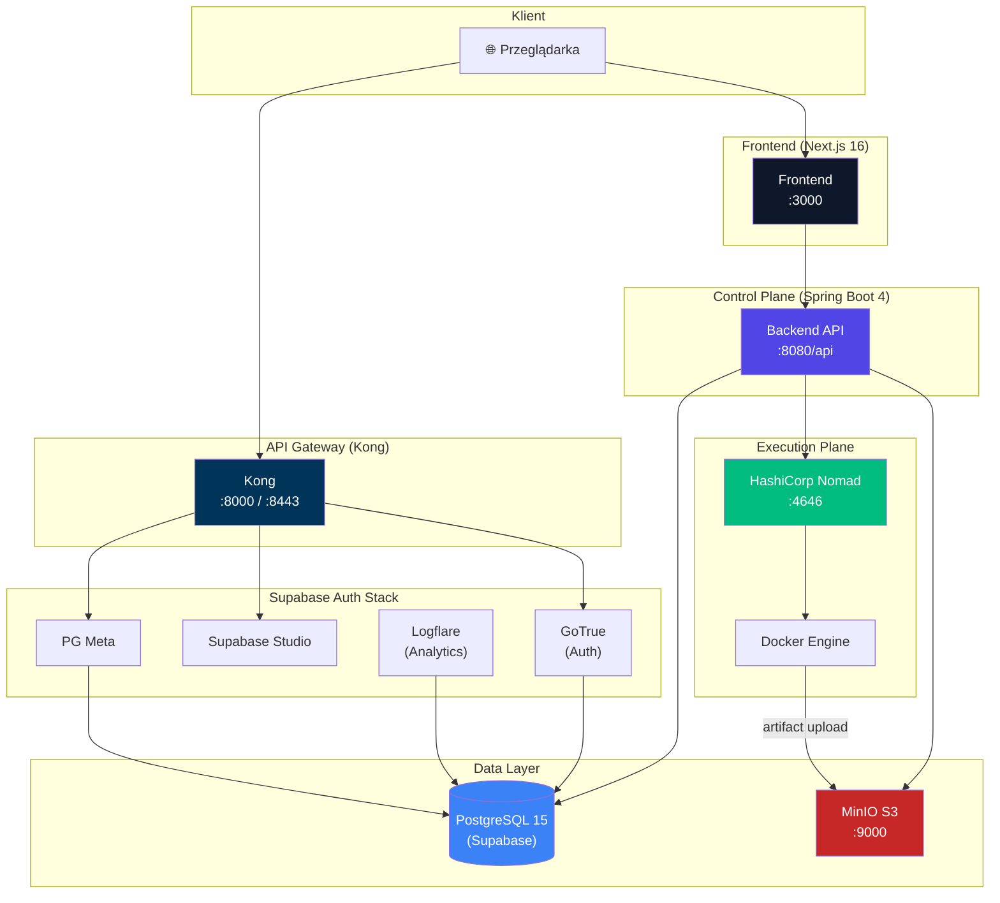

---

## 3. Stos technologiczny

| Warstwa | Technologia | Wersja |
|---------|------------|--------|
| **Backend** | Spring Boot (WebMVC, JPA, Security, Flyway) | 4.0.3 |
| **Język** | Java | 25 |
| **Frontend** | Next.js + React + TypeScript + Tailwind CSS + shadcn/ui | 16.x / React 19 |
| **Baza danych** | PostgreSQL (Supabase) | 15.8 |
| **Orkiestracja** | HashiCorp Nomad | 1.7 |
| **Object Storage** | MinIO (S3-compatible) | latest |
| **Tożsamość** | Supabase GoTrue (JWT HS256) | v2.186 |
| **API Gateway** | Kong | 3.9.1 |
| **ORM** | Hibernate (JPA) | — |
| **Migracje** | Flyway | — |
| **Build** | Maven (backend), npm (frontend) | — |
| **Konteneryzacja** | Docker + Docker Compose | — |
| **API Docs** | SpringDoc OpenAPI (swagger-ui) | 3.0.1 |
| **S3 SDK** | AWS SDK for Java v2 | 2.30.37 |

---

## 4. Infrastruktura Docker Compose

System składa się z **10 serwisów** zdefiniowanych w jednym pliku `docker-compose.yml`:

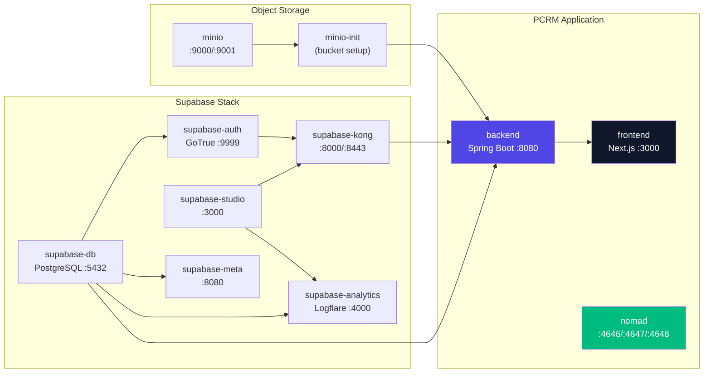

### Zależności startowe serwisów

| Serwis | Zależy od | Warunek |
|--------|-----------|---------|
| `auth` | `db` | `service_healthy` |
| `studio` | `analytics` | `service_healthy` |
| `kong` | `studio` | `service_healthy` |
| `meta` | `db` | `service_healthy` |
| `analytics` | `db` | `service_healthy` |
| `minio-init` | `minio` | `service_healthy` |
| `backend` | `db`, `minio-init`, `kong` | `healthy` / `completed_successfully` |
| `frontend` | `backend` | `service_healthy` |

---

## 5. Backend — struktura pakietów

```mermaid
graph TD
    Root["com.pcrm.backend"]
    Root --> Auth["auth<br/>• config (SecurityConfig, JwtDecoder)<br/>• domain (CustomUserDetails)<br/>• service"]
    Root --> Config["config<br/>• JacksonConfig<br/>• SchedulingConfig"]
    Root --> Events["events<br/>• domain (OutboxMessage)<br/>• repository<br/>• service (OutboxPoller,<br/>  OutboxWriter, HandlerRegistry)"]
    Root --> Exception["exception<br/>• GlobalExceptionHandler<br/>• InsufficientQuotaException<br/>• NomadDispatchException<br/>• ResourceNotFoundException"]
    Root --> Idempotency["idempotency<br/>• domain (IdempotencyRecord)<br/>• service (IdempotencyService)"]
    Root --> Jobs["jobs<br/>• domain (Job, JobStatus,<br/>  JobLogStream, JobLogChunk)<br/>• dto (6 records)<br/>• repository (3 repos)<br/>• resource (JobsResource)<br/>• service (17 klas)<br/>• validation"]
    Root --> Nodes["nodes<br/>• domain (Node, NodeStatus)<br/>• dto<br/>• repository<br/>• resource (NodesResource)<br/>• service (NodeQueryService,<br/>  NodeSyncService)"]
    Root --> NomadPkg["nomad<br/>• interfaces (4 clients)<br/>• http (4 impl.)<br/>• config<br/>• stream"]
    Root --> Quota["quota<br/>• domain (10 encji)<br/>• dto<br/>• repository<br/>• resource (QuotaResource,<br/>  AdminQuotaResource)<br/>• service (QuotaAccountingService,<br/>  QuotaPolicyResolverService,<br/>  AdminQuotaGrantService)"]
    Root --> Storage["storage<br/>• domain (JobArtifact,<br/>  JobArtifactStatus)<br/>• dto<br/>• repository<br/>• resource (StorageResource,<br/>  InternalStorageResource)<br/>• service (StorageService,<br/>  JobArtifactService)"]
    Root --> User["user<br/>• Profile<br/>• UserRole<br/>• repository"]

    style Jobs fill:#4f46e5,color:#fff
    style Quota fill:#059669,color:#fff
    style NomadPkg fill:#00bc7e,color:#fff
    style Storage fill:#c62828,color:#fff
```

---

## 6. Model danych (ERD)

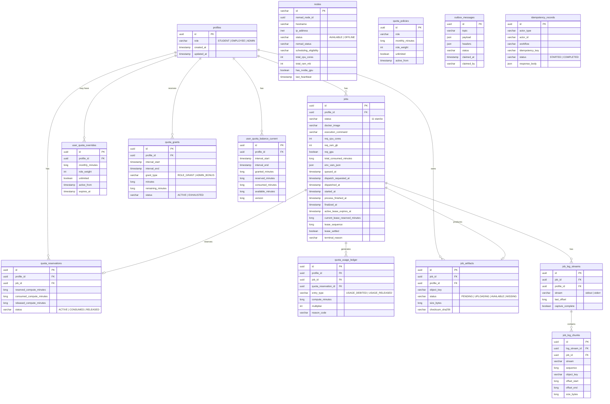

---

## 7. Uwierzytelnianie i autoryzacja

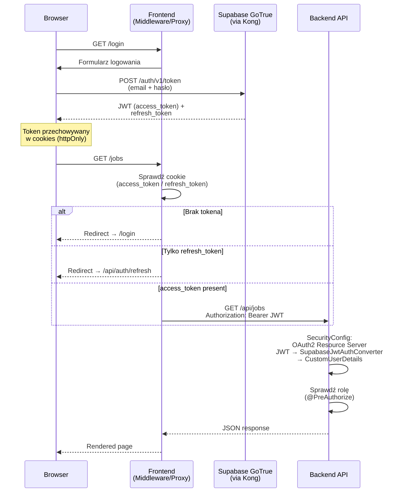

### Role i uprawnienia

| Rola | Opis | Dostęp |
|------|------|--------|
| `STUDENT` | Domyślna rola nowego użytkownika | Zadania własne, kwota, artefakty |
| `EMPLOYEE` | Pracownik z większą kwotą | Jak STUDENT + rozszerzona kwota |
| `ADMIN` | Administrator systemu | Pełny dostęp: węzły, polityki kwotowe, granty, admin panel |

> [!NOTE]
> Konfiguracja bezpieczeństwa w [SecurityConfig.java](file:///c:/Users/bielo/IdeaProjects/private-cloud-resource-manager/backend/src/main/java/com/pcrm/backend/auth/config/SecurityConfig.java) ustawia sesje jako **STATELESS**, a każdy request (poza healthcheck i swagger) wymaga uwierzytelnienia JWT.

---

## 8. Cykl życia zadania (Job Lifecycle)

### 8.1 Maszyna stanów

Klasa [JobStateMachine](file:///c:/Users/bielo/IdeaProjects/private-cloud-resource-manager/backend/src/main/java/com/pcrm/backend/jobs/service/JobStateMachine.java) zarządza przejściami między **11 stanami**:

```mermaid
stateDiagram-v2
    [*] --> SUBMITTED : submitJob()

    SUBMITTED --> QUEUED : admitWithQuotaReservation()
    SUBMITTED --> FAILED : rejectForInsufficientQuota()

    QUEUED --> DISPATCHING : markDispatchRequested()
    QUEUED --> CANCELED : markCanceledByUser()
    QUEUED --> TIMED_OUT : markTimedOut() [lease expired]

    DISPATCHING --> SCHEDULING : markDispatchAccepted()
    DISPATCHING --> DISPATCHING : markDispatchRetryRequested() [stale retry]
    DISPATCHING --> INFRA_FAILED : markDispatchFailed()
    DISPATCHING --> TIMED_OUT : markTimedOut()
    DISPATCHING --> CANCELED : markCanceledByUser()

    SCHEDULING --> RUNNING : applyNomadTransition()
    SCHEDULING --> FAILED : applyNomadTransition()
    SCHEDULING --> TIMED_OUT : markTimedOut()
    SCHEDULING --> CANCELED : markNomadStopped() / markCanceledByUser()

    RUNNING --> FINALIZING : applyNomadTransition() [process complete]
    RUNNING --> FAILED : applyNomadTransition()
    RUNNING --> TIMED_OUT : markTimedOut()
    RUNNING --> CANCELED : markNomadStopped() / markCanceledByUser()

    FINALIZING --> SUCCEEDED : markArtifactAvailable() / markFinalizedWithoutArtifact()
    FINALIZING --> FAILED : markArtifactFailed()

    SUCCEEDED --> [*]
    FAILED --> [*]
    CANCELED --> [*]
    TIMED_OUT --> [*]
    INFRA_FAILED --> [*]

    note right of SUCCEEDED : Stany terminalne:<br/>SUCCEEDED, FAILED,<br/>CANCELED, TIMED_OUT,<br/>INFRA_FAILED
```

### 8.2 Pełny przepływ zadania (sekwencja)

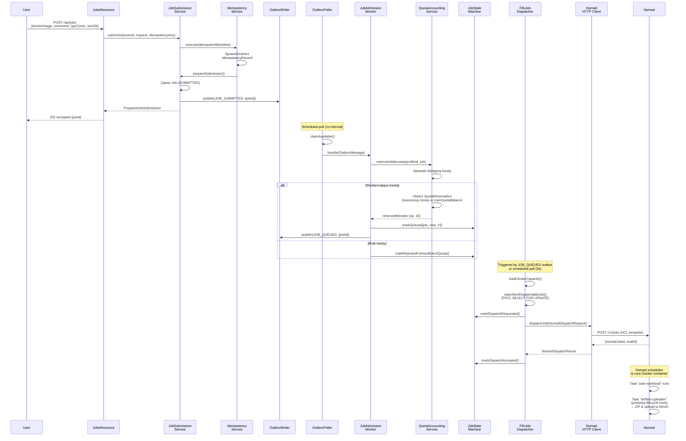

---

## 9. System Outbox — asynchroniczne zdarzenia

System implementuje **Transactional Outbox Pattern** do niezawodnej propagacji zdarzeń wewnętrznych.

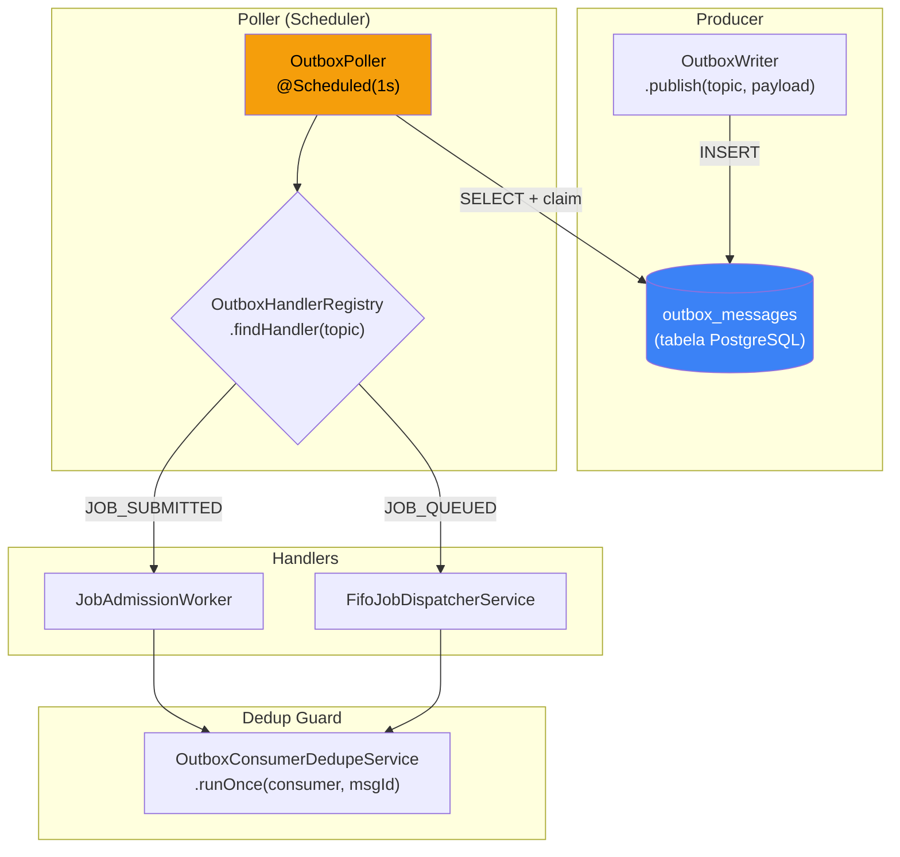

### Tematy (Topics)

| Topic | Publisher | Handler |
|-------|----------|---------|
| `JobSubmitted` | [JobOutboxPublisher](file:///c:/Users/bielo/IdeaProjects/private-cloud-resource-manager/backend/src/main/java/com/pcrm/backend/jobs/service/JobOutboxPublisher.java) (po zapisie Job) | [JobAdmissionWorker](file:///c:/Users/bielo/IdeaProjects/private-cloud-resource-manager/backend/src/main/java/com/pcrm/backend/jobs/service/JobAdmissionWorker.java) |
| `JobQueued` | JobOutboxPublisher (po admisji) | [FifoJobDispatcherService](file:///c:/Users/bielo/IdeaProjects/private-cloud-resource-manager/backend/src/main/java/com/pcrm/backend/jobs/service/FifoJobDispatcherService.java) |

> [!IMPORTANT]
> Outbox Poller działa z claim-based locking — każda wiadomość jest „claimed" przez konkretnego workera na czas przetwarzania (`claim-timeout-ms: 60s`). W przypadku niepowodzenia, wiadomość jest oznaczana jako failed z `retry-delay-ms: 5s`.

---

## 10. Mechanizm leasingowy (Prepaid Billing)

System billing oparty jest na **prepaid lease** — minuty obliczeniowe są rezerwowane z góry i odnawialne.

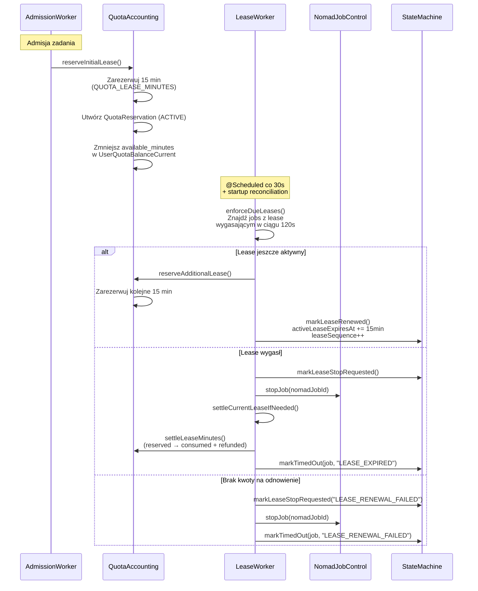

### Kluczowe parametry lease

| Parametr | Wartość domyślna | Opis |
|----------|-----------------|------|
| `app.quota.lease-minutes` | 15 | Długość jednego lease'u (w minutach) |
| `app.scheduler.lease.interval-ms` | 30 000 | Interwał sprawdzania lease'ów |
| `app.scheduler.lease.safety-window-ms` | 120 000 | Okno wyprzedzające (2 min przed wygaśnięciem) |
| `app.scheduler.lease.batch-size` | 50 | Maks. jobs przetwarzanych w jednym cyklu |

---

## 11. System kwotowy

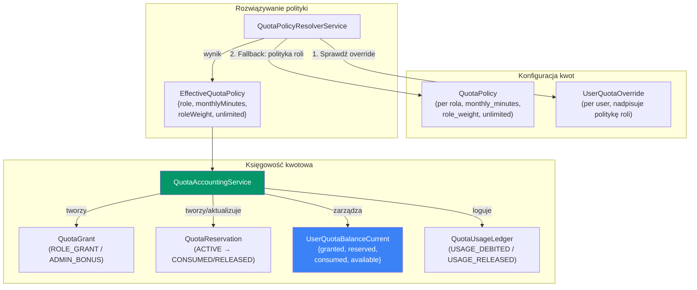

### Formuła salda

```
available_minutes = granted_minutes − reserved_minutes − consumed_minutes
```

### Typy grantów

| Typ | Źródło | Opis |
|-----|--------|------|
| `ROLE_GRANT` | Automatyczny | Tworzony przy pierwszym użyciu w danym miesiącu na podstawie polityki roli |
| `ADMIN_BONUS` | Ręczny (admin) | Dodatkowe minuty przyznane przez administratora |

---

## 12. Synchronizacja węzłów Nomad

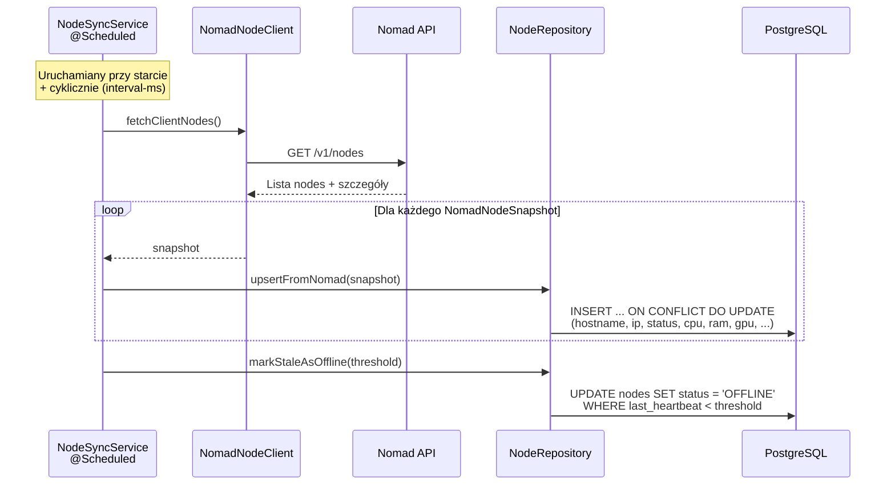

> [!NOTE]
> Każdy node przechowuje informacje z Nomad: hostname, IP, status, scheduling eligibility, datacenter, node pool, CPU cores, RAM, wersje oprogramowania, oraz flagi (draining, GPU NVIDIA).

---

## 13. Dyspozycja zadań do Nomad

[FifoJobDispatcherService](file:///c:/Users/bielo/IdeaProjects/private-cloud-resource-manager/backend/src/main/java/com/pcrm/backend/jobs/service/FifoJobDispatcherService.java) odpowiada za wysyłanie zadań do Nomad:

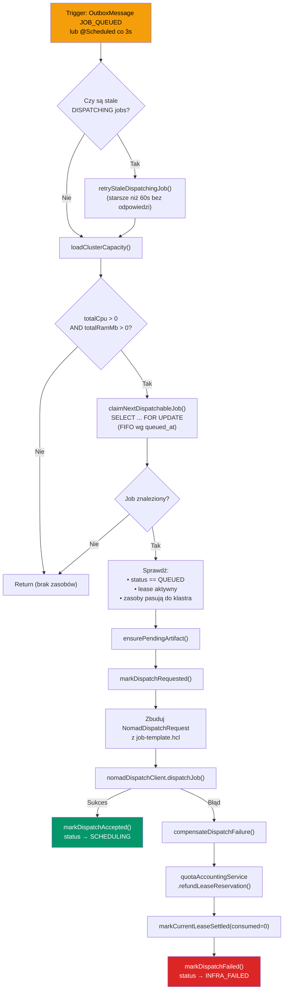

### Nomad Job Template (HCL)

Szablon [job-template.hcl](file:///c:/Users/bielo/IdeaProjects/private-cloud-resource-manager/nomad/job-template.hcl) definiuje zadanie Nomad z **dwoma taskami**:

| Task | Typ | Opis |
|------|-----|------|
| `user-workload` | główny | Uruchamia kontener Docker użytkownika z zadanym `DOCKER_IMAGE` i `EXECUTION_COMMAND` |
| `artifact-uploader` | `poststop` | Po zakończeniu user-workload: pakuje `/alloc/data` do ZIP i uploaduje na MinIO via presigned URL |

---

## 14. Przechowywanie artefaktów (S3/MinIO)

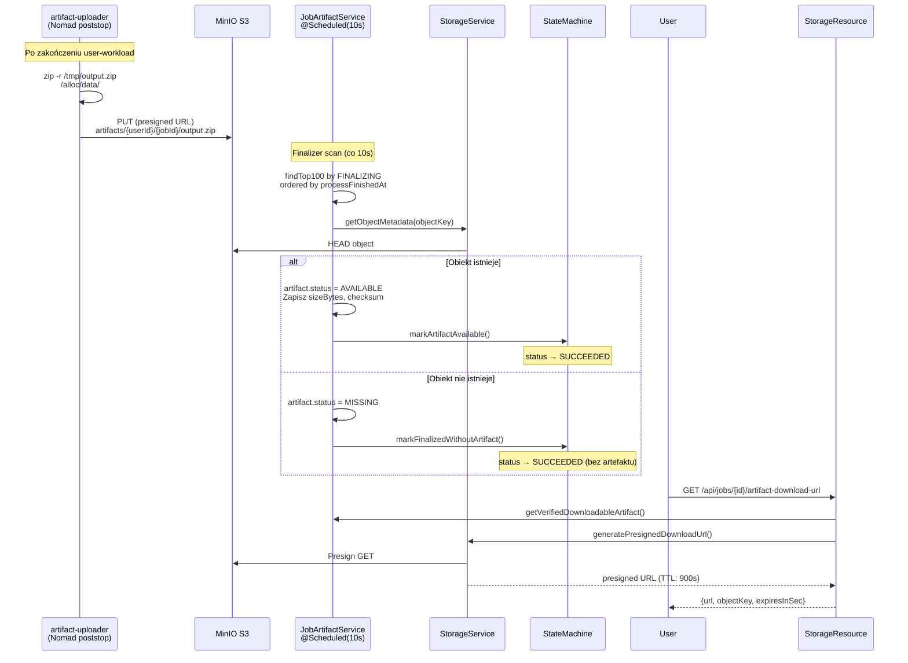

### Struktura kluczy S3

| Typ | Wzorzec klucza |
|-----|----------------|
| Artefakty | `artifacts/{userId}/{jobId}/output.zip` |
| Logi | `logs/{userId}/{jobId}/{stdout\|stderr}/{sequence}.log` |

---

## 15. Przechwytywanie logów

[JobLogCaptureService](file:///c:/Users/bielo/IdeaProjects/private-cloud-resource-manager/backend/src/main/java/com/pcrm/backend/jobs/service/JobLogCaptureService.java) cyklicznie pobiera logi z Nomad:

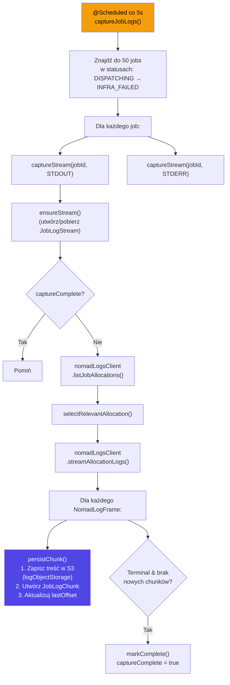

> [!TIP]
> Logi mogą być przechowywane w S3 (`S3JobLogObjectStorage`) lub w pamięci (`InMemoryJobLogObjectStorage`), zależnie od konfiguracji profilu Spring.

---

## 16. API REST — mapa endpointów

Wszystkie endpointy mają prefix `/api` (via `server.servlet.context-path`).

### Jobs

| Metoda | Ścieżka | Opis | Autoryzacja |
|--------|---------|------|-------------|
| `GET` | `/jobs` | Lista zadań użytkownika (paginacja, filtr statusu) | Authenticated |
| `GET` | `/jobs/{id}` | Szczegóły zadania | Authenticated (owner) |
| `GET` | `/jobs/{id}/events` | SSE stream szczegółów zadania | Authenticated (owner) |
| `GET` | `/jobs/{id}/logs` | Logi zadania (stdout/stderr) | Authenticated (owner) |
| `POST` | `/jobs` | Przesłanie nowego zadania | Authenticated |
| `POST` | `/jobs/{id}/cancel` | Anulowanie zadania | Authenticated (owner) |
| `GET` | `/jobs/{id}/artifact-download-url` | Presigned download URL artefaktu | Authenticated (owner) |

### Quota

| Metoda | Ścieżka | Opis | Autoryzacja |
|--------|---------|------|-------------|
| `GET` | `/quota/me` | Podsumowanie kwoty użytkownika | Authenticated |
| `GET` | `/quota/usage-ledger` | Historia użycia kwoty (per miesiąc) | Authenticated |

### Admin Quota

| Metoda | Ścieżka | Opis | Autoryzacja |
|--------|---------|------|-------------|
| `GET` | `/admin/quota/users` | Lista użytkowników (do grantów) | ADMIN |
| `PUT` | `/admin/quota/policies/{role}` | Upsert polityki kwotowej dla roli | ADMIN |
| `PUT` | `/admin/quota/overrides/{userId}` | Upsert override kwotowego dla użytkownika | ADMIN |
| `POST` | `/admin/quota/grants` | Przyznanie dodatkowych minut | ADMIN |

### Nodes

| Metoda | Ścieżka | Opis | Autoryzacja |
|--------|---------|------|-------------|
| `GET` | `/nodes` | Lista węzłów klastra | ADMIN |
| `GET` | `/nodes/{id}` | Szczegóły węzła | ADMIN |
| `GET` | `/nodes/gpu-available` | Czy GPU jest dostępne | Authenticated |

### Inne

| Metoda | Ścieżka | Opis | Autoryzacja |
|--------|---------|------|-------------|
| `GET` | `/actuator/health` | Health check | Public |
| `GET` | `/v3/api-docs/**` | OpenAPI spec (domyślnie wyłączone) | Public |

---

## 17. Frontend — architektura i routing

Frontend oparty na **Next.js 16** (App Router) z TypeScript i Tailwind CSS 4.

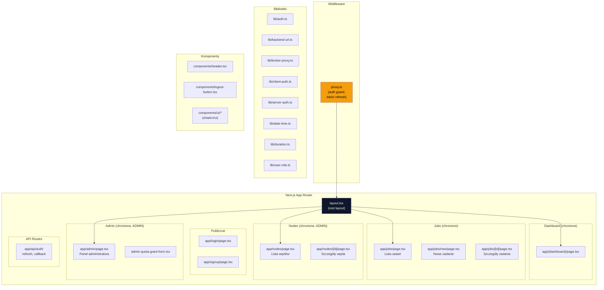

### Middleware (proxy.ts)

[proxy.ts](file:///c:/Users/bielo/IdeaProjects/private-cloud-resource-manager/frontend/src/proxy.ts) pełni rolę auth guard:

| Warunek | Akcja |
|---------|-------|
| Strona auth + `access_token` | Redirect → `/` (lub `?next=...`) |
| `refresh_token` bez `access_token` | Redirect → `/api/auth/refresh` |
| Strona chroniona bez tokena | Redirect → `/login?next=...` |

---

## 18. Background Workers i Schedulery

System wykorzystuje `@Scheduled` annotacje Spring do cyklicznych zadań:

```mermaid
gantt
    title Background Workers — interwały
    dateFormat X
    axisFormat %s

    section Outbox
    OutboxPoller (1s)               :active, 0, 1
    OutboxPoller (1s)               :active, 1, 2
    OutboxPoller (1s)               :active, 2, 3

    section Dispatcher
    FifoJobDispatcher (3s)          :active, 0, 3

    section Logs
    JobLogCaptureService (5s)       :active, 0, 5

    section Artifacts
    JobArtifactFinalizer (10s)      :active, 0, 10

    section Nodes
    NodeSyncService (configurable)  :active, 0, 10

    section Lease
    LeaseWorker (30s)               :active, 0, 30
```

| Worker | Klasa | Interwał | Cel |
|--------|-------|----------|-----|
| **OutboxPoller** | [OutboxPoller](file:///c:/Users/bielo/IdeaProjects/private-cloud-resource-manager/backend/src/main/java/com/pcrm/backend/events/service/OutboxPoller.java) | 1s | Polling outbox messages |
| **FifoJobDispatcher** | [FifoJobDispatcherService](file:///c:/Users/bielo/IdeaProjects/private-cloud-resource-manager/backend/src/main/java/com/pcrm/backend/jobs/service/FifoJobDispatcherService.java) | 3s | Dispatch queued jobs do Nomad |
| **LeaseWorker** | [LeaseWorker](file:///c:/Users/bielo/IdeaProjects/private-cloud-resource-manager/backend/src/main/java/com/pcrm/backend/jobs/service/LeaseWorker.java) | 30s | Enforcement/renewal lease'ów |
| **JobLogCapture** | [JobLogCaptureService](file:///c:/Users/bielo/IdeaProjects/private-cloud-resource-manager/backend/src/main/java/com/pcrm/backend/jobs/service/JobLogCaptureService.java) | 5s | Capture stdout/stderr z Nomad |
| **ArtifactFinalizer** | [JobArtifactService](file:///c:/Users/bielo/IdeaProjects/private-cloud-resource-manager/backend/src/main/java/com/pcrm/backend/storage/service/JobArtifactService.java) | 10s | Sprawdzanie artefaktów na S3 |
| **NodeSync** | [NodeSyncService](file:///c:/Users/bielo/IdeaProjects/private-cloud-resource-manager/backend/src/main/java/com/pcrm/backend/nodes/service/NodeSyncService.java) | konfigurowalny | Synchronizacja stanu węzłów z Nomad |
| **IdempotencyCleanup** | — | cron (co godzinę) | Czyszczenie starych rekordów idempotencji |

---

## 19. Idempotencja

System zapewnia idempotencję operacji krytycznych (np. submission zadania, admin grant kwotowy) poprzez wzorzec **Idempotency Key**:

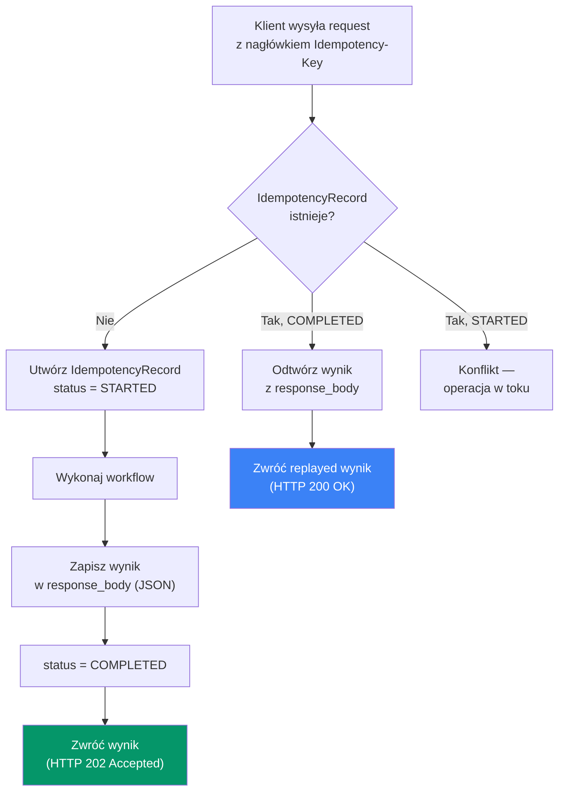

---

## 20. Podsumowanie

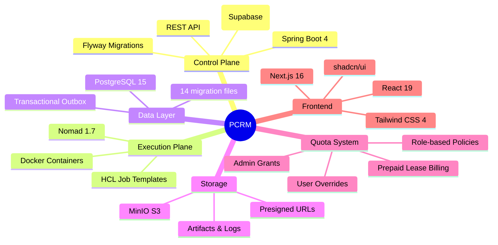

### Kluczowe wzorce architektoniczne

| Wzorzec | Implementacja |
|---------|--------------|
| **Transactional Outbox** | `OutboxMessage` → `OutboxPoller` → handlery |
| **State Machine** | `JobStateMachine` — 11 stanów, przejścia z walidacją |
| **FIFO Queue** | `SELECT ... ORDER BY queued_at FOR UPDATE` |
| **Lease Renewal** | `LeaseWorker` — cykliczne odnawianie z rezerwacją kwoty |
| **Idempotency Key** | `IdempotencyRecord` — at-most-once semantics |
| **Consumer Dedup** | `OutboxConsumerDedupeService` — exactly-once processing |
| **Presigned URL** | Upload/download artefaktów bez proxy-owania przez backend |
| **RBAC** | `@PreAuthorize("hasRole('ADMIN')")` + role z JWT |
| **Event-Driven** | Outbox → handler (in-process, polling-based) |
| **Pessimistic Locking** | `FOR UPDATE` na jobs i quota balance |
